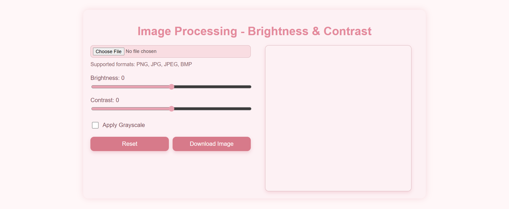
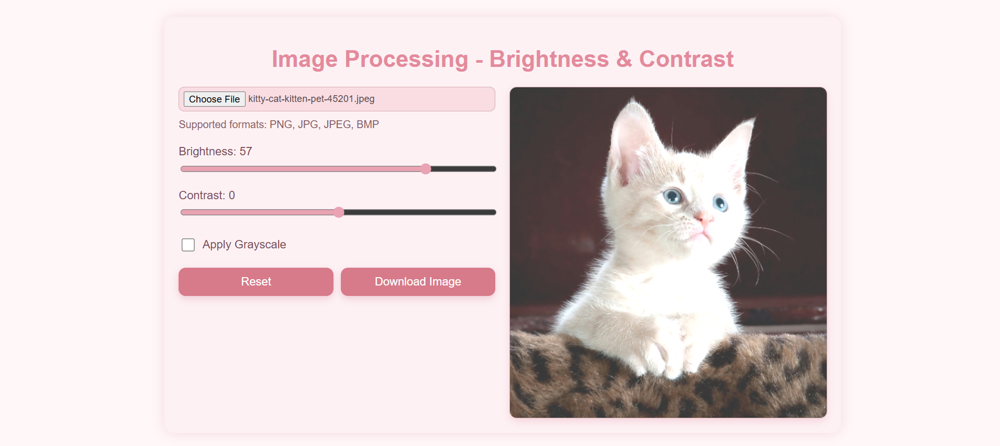
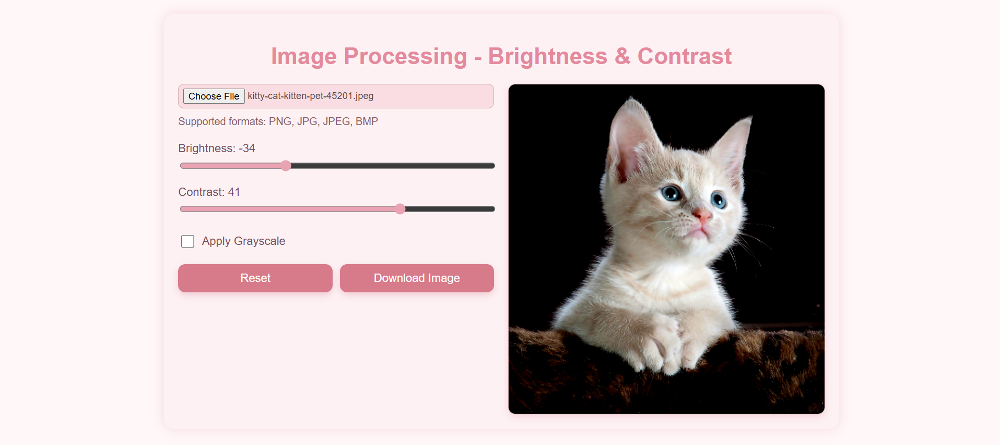
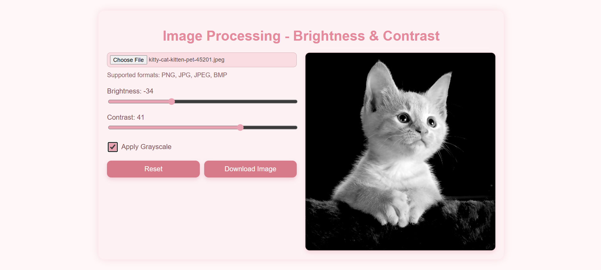
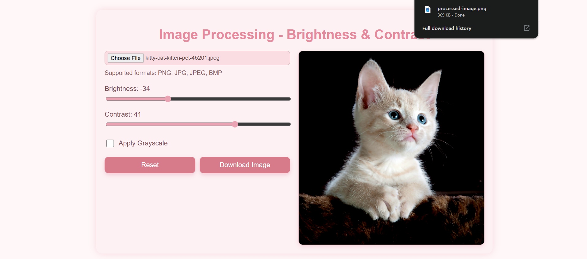

# Image Preprocessing – Brightness & Contrast Adjustments

**Image Preprocessing** is a simple browser-based project built using HTML, CSS, and JavaScript. It demonstrates basic preprocessing operations like brightness, contrast adjustment, and grayscale conversion on images using 2D arrays (pixel-level operations). The project provides a clean and minimal UI where users can upload an image, apply filters, and download the processed result.

## Features

- **Upload Image**
  - Supports PNG, JPG, JPEG, BMP formats.
  - Automatically scales large images to fit the canvas.
- **Brightness Adjustment**
  - Modify the brightness level using a slider.
  - Displays the real-time brightness value.
- **Contrast Adjustment**
  - Increase or decrease contrast dynamically with a slider.
  - Displays the current contrast level.
- **Grayscale Conversion**
  - Apply grayscale filter using a checkbox toggle.
  - Uses luminance formula for realistic grayscale results.
- **Reset & Download**
  - Reset button restores the original uploaded image.
  - Download button saves the processed image to the system.
- **Responsive UI**
  - Pastel-themed interface with soft styling.
  - Works smoothly on both desktop and mobile devices.

## Tech Stack

- **Frontend:** HTML5, CSS3  
- **Image Processing Logic:** Vanilla JavaScript with Canvas API (pixel-level operations)  
- **No Backend Required:** All processing happens in the browser.  

## Getting Started

1. Clone the repository
```bash
git clone https://github.com/your-username/ImagePreprocessing.git
cd ImagePreprocessing
```
- Run the project
  - Simply open the index.html file in any browser.
  - No server setup is required.

## Project Structure
```bash
ImagePreprocessing/
├── index.html        # Main UI for image preprocessing
├── style.css         # Styling for pastel-themed layout
├── script.js         # Core logic: brightness, contrast, grayscale, reset, download
├── screenshots/      # Folder for UI screenshots
└── README.md         # Project documentation
```

## Screenshots
1. Home Page – Initial UI with upload option


2. Brightness Adjustment – Uploading an image and increasing brightness


3. Contrast Adjustment – Adjusting contrast levels dynamically


4. Grayscale Conversion – Applying grayscale filter


5. Download Option – Saving the processed image


## Future Improvements
- Add cropping and rotation options.
- Include filters like sepia, blur, sharpen.
- Support drag-and-drop image upload.
- Add undo/redo functionality for multiple edits.

##
## Coded by Mahi Shukla, Abhishek Karthik